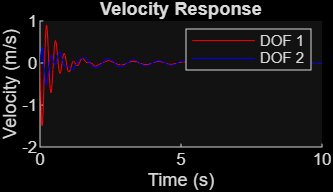
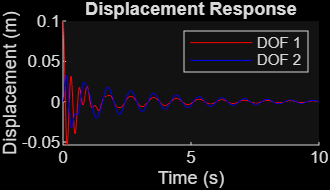

# 2-DOF Vibration Analysis GUI (MATLAB App Designer)

This MATLAB App simulates and visualizes the dynamic response of a **2-degree-of-freedom mass-spring-damper system**. Built using **MATLAB App Designer**, it provides interactive input fields and plots the displacement and velocity response over time.

## Features
- Input masses, spring constants, and damping coefficients
- Set initial displacements for both masses
- Computes and displays natural frequencies (ω₁ and ω₂)
- Visualizes displacement and velocity for both DOFs
- Built-in GUI for intuitive simulation and analysis

## Screenshots
### Displacement & Velocity Simulation

### Input Parameters and Result Display

## Tech Stack
- MATLAB App Designer (`.mlapp`)
- Numerical Integration: `ode45`
- Linear Algebra: State-Space formulation

## Files Included
- `dofapp1.mlapp` — complete app file (run in App Designer)
- `untitled1.png`, `untitled2.png` — UI screenshots

## How to Run
1. Open MATLAB
2. Launch App Designer
3. Open `dofapp1.mlapp`
4. Click "Run"
